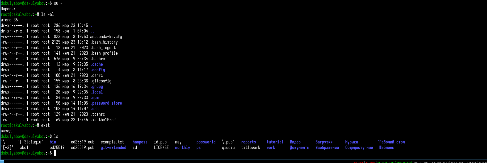
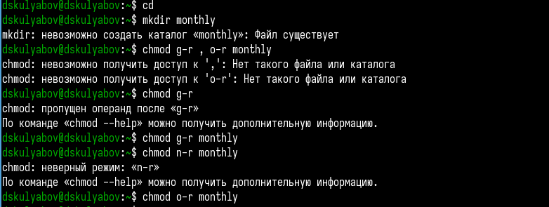
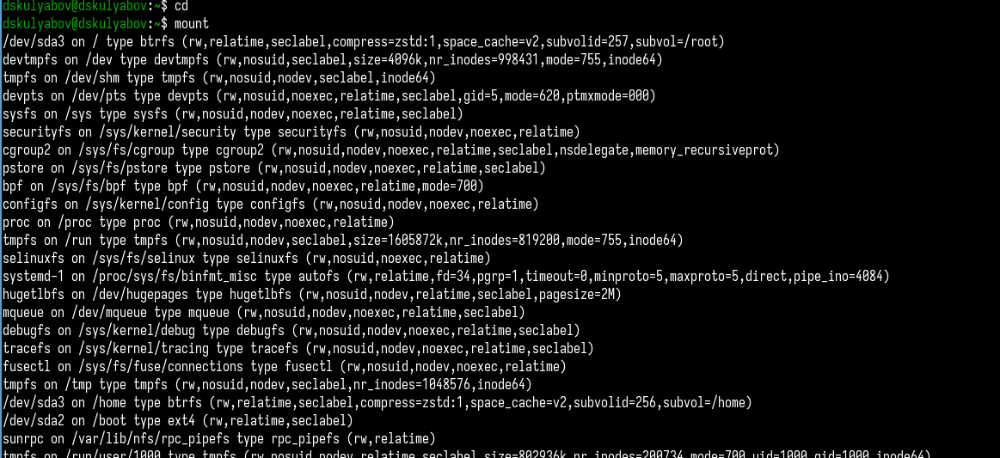
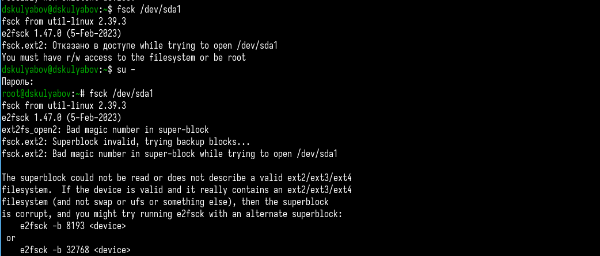

---
## Front matter
title: "Шаблон отчёта по лабораторной работе"
subtitle: "Простейший вариант"
author: "Хань Цзянтао"

## Generic otions
lang: ru-RU
toc-title: "Содержание"

## Bibliography
bibliography: bib/cite.bib
csl: pandoc/csl/gost-r-7-0-5-2008-numeric.csl

## Pdf output format
toc: true # Table of contents
toc-depth: 2
lof: true # List of figures
lot: true # List of tables
fontsize: 12pt
linestretch: 1.5
papersize: a4
documentclass: scrreprt
## I18n polyglossia
polyglossia-lang:
  name: russian
  options:
	- spelling=modern
	- babelshorthands=true
polyglossia-otherlangs:
  name: english
## I18n babel
babel-lang: russian
babel-otherlangs: english
## Fonts
mainfont: PT Serif
romanfont: PT Serif
sansfont: PT Sans
monofont: PT Mono
mainfontoptions: Ligatures=TeX
romanfontoptions: Ligatures=TeX
sansfontoptions: Ligatures=TeX,Scale=MatchLowercase
monofontoptions: Scale=MatchLowercase,Scale=0.9
## Biblatex
biblatex: true
biblio-style: "gost-numeric"
biblatexoptions:
  - parentracker=true
  - backend=biber
  - hyperref=auto
  - language=auto
  - autolang=other*
  - citestyle=gost-numeric
## Pandoc-crossref LaTeX customization
figureTitle: "Рис."
tableTitle: "Таблица"
listingTitle: "Листинг"
lofTitle: "Список иллюстраций"
lotTitle: "Список таблиц"
lolTitle: "Листинги"
## Misc options
indent: true
header-includes:
  - \usepackage{indentfirst}
  - \usepackage{float} # keep figures where there are in the text
  - \floatplacement{figure}{H} # keep figures where there are in the text
---

# Цель работы

Ознакомление с файловой системой Linux, её структурой, именами и содержанием каталогов. Приобретение практических навыков по применению команд для работы с файлами и каталогами, по управлению процессами (и работами), по проверке использования диска и обслуживанию файловой системы.

# Задание

1. Команды для работы с файлами и каталогами
2. Копирование файлов и каталогов
3. Перемещение и переименование файлов и каталогов
4. Права доступа

# Теоретическое введение

Понимать команды для обработки файлов и каталогов

Научитесь копировать файлы и каталоги

 Перемещение и переименование файлов и каталогов

Понимать права доступа

Изменение прав доступа

 Анализ файловой системы

# Выполнение лабораторной работыУказания к работе

### 4.1Команды для работы с файлами и каталогами

Для создания текстового файла можно использовать команду touch. Формат команды: 

```
touch имя-файла 
```

{#fig:001 width=70%}

Для просмотра файлов небольшого размера можно использовать команду cat. Формат команды: 

```
cat имя-файла 
```

{#fig:001 width=70%}

Для просмотра файлов постранично удобнее использовать команду less. Формат команды:

```
less имя-файла 
```

{#fig:001 width=70%}

Следующие клавиши используются для управления процессом просмотра: – Space — переход к следующей странице, 

– ENTER — сдвиг вперёд на одну строку,

 – b — возврат на предыдущую страницу, 

– h — обращение за подсказкой, 

– q — выход из режима просмотра файла.

 Команда head выводит по умолчанию первые 10 строк файла. Формат команды: 

head [-n] имя-файла, где n — количество выводимых строк. 

{#fig:001 width=70%}

Команда tail выводит умолчанию 10 последних строк файла. Формат команды: 

```
tail [-n] имя-файла, где n — количество выводимых строк.
```

{#fig:001 width=70%}

где n — количество выводимых строк.

### 4.2Копирование файлов и каталогов

Команда cp используется для копирования файлов и каталогов. Формат команды: 

```
cp [-опции] исходный_файл целевой_файл
```

Примеры: 1. Копирование файла в текущем каталоге. Скопировать файл ~/abc1 в файл april и в файл may:

```
cd  

touch abc1 

cp abc1 april 

cp abc1 may
```

{#fig:001 width=70%}

2. Копирование нескольких файлов в каталог. Скопировать файлы april и may в каталог monthly

    

   ```
   mkdir monthly 
   cp april may monthly
   ```

{#fig:001 width=70%}

3. Копирование файлов в произвольном каталоге.Скопировать файл monthly/may в файл с именем june: 

   ```
   cp monthly/may monthly/june 
   ```

   ```
   ls monthly
   ```

{#fig:001 width=70%}

   Опция i в команде cp выведет на экран запрос подтверждения о перезаписи файла. Для рекурсивного копирования каталогов, содержащих файлы, используется команда cp с опцией r. Примеры: 

   1. Копирование каталогов в текущем каталоге. Скопировать каталог monthly в каталог monthly.00: 

      ```
      mkdir monthly.00 
      
      cp -r monthly monthly.00
      ```

  {#fig:001 width=70%}

    2.Копирование каталогов в произвольном каталоге. Скопировать каталог monthly.00 в каталог /tmp

   ```
   cp -r monthly.00 /tmp
   ```

{#fig:001 width=70%}
### 4.3Перемещение и переименование файлов и каталогов

 Команды mv и mvdir предназначены для перемещения и переименования файлов и каталогов. Формат команды mv:

```
mv [-опции] старый_файл новый_файл
```

1. Переименование файлов в текущем каталоге. Изменить название файла april на july в домашнем каталоге:

```
cd 

mv april july
```

{#fig:001 width=70%}

2. Перемещение файлов в другой каталог. Переместить файл july в каталог monthly.00:

   ```
   mv july monthly.00 
   
    ls monthly.00
   ```

{#fig:001 width=70%}

3.Если необходим запрос подтверждения о перезаписи файла, то нужно использовать опцию i. 3. Переименование каталогов в текущем каталоге. Переименовать каталог monthly.00 в monthly.01

```
mv monthly.00 monthly.01
```

{#fig:001 width=70%}

4.Перемещение каталога в другой каталог. Переместить каталог monthly.01в каталог reports:

```
mkdir reports

 mv monthly.01 reports
```

{#fig:001 width=70%}

Переименование каталога, не являющегося текущим. Переименовать каталог reports/monthly.01 в reports/monthly:

```
mv reports/monthly.01 reports/monthly
```

{#fig:001 width=70%}
### 4.4Права доступа

Каждый файл или каталог имеет права доступа (табл. 5.1). 

В сведениях о файле или каталоге указываются:

 – тип файла (символ (-) обозначает файл, а символ (d) — каталог); 

– права для владельца файла (r — разрешено чтение, w — разрешена запись, x — разрешено выполнение, - — право доступа отсутствует); 

– права для членов группы (r — разрешено чтение, w — разрешена запись, x — разрешено выполнение, - — право доступа отсутствует); 

– права для всех остальных (r — разрешено чтение, w — разрешена запись, x — разрешено выполнение, - — право доступа отсутствует). 

Примеры:

​																						Права доступа

------

Право 			Обозначение 				Файл						 														Каталог

------

Чтение				 r   				Разрешены просмотр  и копирование				Разрешён просмотр списка входящих файлов

Запись				w                   Разрешены изменение и переименование       Разрешены создание и удаление файлов


Выполнение	 x 					Разрешено выполнение файла                Разрешён доступ в каталог и есть возможность сделать его 													(скриптов и/или программ)																	текущим

------

1. Для файла (крайнее левое поле имеет значение -) владелец файла имеет право на чтение и запись (rw-), группа, в которую входит владелец файла, может читать файл (r--), все остальные могут читать файл (r--):

   ```
   -rw-r--r--
   ```

2. Только владелец файла имеет право на чтение, изменение и выполнение файла:

```
 -rwx------
```

3. Владелец каталога (крайнее левое поле имеет значение d) имеет право на просмотр, изменение и доступа в каталог, члены группы могут входить и просматривать его, все остальные — только входить в каталог:3.

   ```
   drwxr-x--x
   ```

{#fig:001 width=70%}

###  4.5Изменение прав доступа

Права доступа к файлу или каталогу можно изменить, воспользовавшись командой chmod. Сделать это может владелец файла (или каталога) или пользователь с правами администратора. Формат команды:

```
chmod режим имя_файла
```

Режим (в формате команды) имеет следующие компоненты структуры и способ записи: 

= установить право 

-лишить права 

+дать право

r чтение

w запись

x выполнение

u (user) владелец файлаv

g (group) группа, к которой принадлежит владелец файла

o (others) все остальные

В работе с правами доступа можно использовать их цифровую запись (восьмеричное значение) вместо символьной 

​																Формы записи прав доступа

------

Двоичная 						Восьмеричная						 Символьная

------

111 										7 														rwx

110 									    6 														rw

101 										5 														r-x 

100 									    4 											            r-- 

011										 3 														-wx 

010										 2														 -w

001 										1 														--x 

000										 0 														---

------

Примеры: 

Требуется создать файл ~/may с правом выполнения для владельца:

```
cd 

touch may

ls -l may 

chmod u+x may 


ls -l may
```

{#fig:001 width=70%}

Требуется лишить владельца файла ~/may права на выполнение:

```
 chmod u-x may 

 ls -l may
```

{#fig:001 width=70%}

Требуется создать каталог monthly с запретом на чтение для членов группы и всех остальных пользователей:

```
cd 

mkdir monthly 

chmod g-r, o-r monthly
```

{#fig:001 width=70%}

Требуется создать файл ~/abc1 с правом записи для членов группы:

```
cd 

touch abc1 

chmod g+w abc1
```

{#fig:001 width=70%}


### 4.6Анализ файловой системы

Файловая система в Linux состоит из фалов и каталогов. Каждому физическому носителю соответствует своя файловая система. Существует несколько типов файловых систем. Перечислим наиболее часто встречающиеся типы: – ext2fs (second extended filesystem); – ext2fs (third extended file system); – ext4 (fourth extended file system); – ReiserFS; – xfs; – fat (file allocation table); – ntfs (new technology file system). Для просмотра используемых в операционной системе файловых систем можно воспользоваться командой mount без параметров. В результате её применения можно получить примерно следующее:


```
mount

 proc on /proc type proc (rw) 

 sysfs on /sys type sysfs (rw,nosuid,nodev,noexec) 

 udev on /dev type tmpfs (rw,nosuid) 

devpts on /dev/pts type devpts (rw,nosuid,noexec)

 /dev/sda1 on /mnt/a type ext3 (rw,noatime) 

 /dev/sdb2 on /mnt/docs type reiserfs (rw,noatime) 

 shm on /dev/shm type tmpfs (rw,noexec,nosuid,nodev) 

 usbfs on /proc/bus/usb type usbfs 

 (rw,noexec,nosuid,devmode=0664,devgid=85)

 binfmt_misc on /proc/sys/fs/binfmt_misc type binfmt_misc 

 (rw,noexec,nosuid,nodev) 

 nfsd on /proc/fs/nfs type nfsd (rw,noexec,nosuid,nodev)
```

{#fig:001 width=70%}

​	В данном случае указаны имена устройств, названия соответствующих им точек монтирования (путь), тип файловой системы и параметрами монтирования. В контексте команды mount устройство — специальный файл устройства, с помощью которого операционная система получает доступ к аппаратному устройству. Файлы устройств обычно располагаются в каталоге /dev, имеют сокращённые имена (например, sdaN, sdbN или hdaN, hdbN, где N — порядковый номер устройства, sd — устройства SCSI, hd — устройства MFM/IDE). Точка монтирования — каталог (путь к каталогу), к которому присоединяются файлы устройств. Другой способ определения смонтированных в операционной системе файловых систем — просмотр файла/etc/fstab. Сделать это можно например с помощью команды cat:

```
cat /etc/fstab 


 /dev/hda1 / ext2 defaults 1 1 

/dev/hda

/home ext2 defaults 1 2 5 /dev/hda6 swap swap defaults 0 0 

 /dev/hdc /mnt/cdrom auto umask=0,user,noauto,ro,exec,users 0 0
 none /mnt/floppy supermount dev=/dev/fd0,fs=ext2:vfat,--,
 sync,umask=0 0 0
 none /proc proc defaults 0 0
none /dev/pts devpts mode=0622 0 0
```

{#fig:001 width=70%}

В каждой строке этого файла указано:

– имя устройство;

– точка монтирования;

 – тип файловой системы;

 – опции монтирования; 

– специальные флаги для утилиты dump;

​	Для определения объёма свободного пространства на файловой системе можно воспользоваться командой df, которая выведет на экран список всех файловых систем в соответствии с именами устройств, с указанием размера и точки монтирования. Например:

```
df 

 Filesystem 1024-blocks Used Available Capacity Mounted on 

/dev/hda3 297635 169499 112764 60% /
```

{#fig:001 width=70%}
С помощью команды fsck можно проверить (а в ряде случаев восстановить) целостность файловой системы: Формат команды:

```
fsck имя_устройства
```

Пример:

```
fsck /dev/sda1
```

{#fig:001 width=70%}

# Список литературы{.unnumbered}

::: {#refs}

1. GDB: The GNU Project Debugger. — URL: https://www.gnu.org/software/gdb/.

2. GNU Bash Manual. — 2016. — URL: https://www.gnu.org/software/bash/manual/.

3. Midnight Commander Development Center. — 2021. — URL: https://midnight

commander. org/.

4. NASM Assembly Language Tutorials. — 2021. — URL: https://asmtutor.com/.

5. Newham C. Learning the bash Shell: Unix Shell Programming. — O’Reilly

Media, 2005. — 354 с. — (In a Nutshell). — ISBN 0596009658. — URL:

http://www.amazon.com/Learningbash-Shell-Programming-Nutshell/dp/0596009658.

6. Robbins A. Bash Pocket Reference. — O’Reilly Media, 2016. — 156 с. — ISBN

978-1491941591.

7. The NASM documentation. — 2021. — URL: https://www.nasm.us/docs.php.

8. Zarrelli G. Mastering Bash. — Packt Publishing, 2017. — 502 с. — ISBN

9781784396879.

9. Колдаев В. Д., Лупин С. А. Архитектура ЭВМ. — М. : Форум, 2018.

10. Куляс О. Л., Никитин К. А. Курс программирования на ASSEMBLER. — М. :

Солон-Пресс, 2017.

11. Новожилов О. П. Архитектура ЭВМ и систем. — М. : Юрайт, 2016.

12. Расширенный ассемблер: NASM.— 2021.—URL: https://www.opennet.ru/docs/RUS/nasm/.

13. Робачевский А., Немнюгин С., Стесик О. Операционная система UNIX. — 2-е

изд. — БХВПетербург, 2010. — 656 с. — ISBN 978-5-94157-538-1.

14. Столяров А. Программирование на языке ассемблера NASM для ОС Unix.— 2-

е изд.—М. : МАКС Пресс, 2011.—URL: http://www.stolyarov.info/books/asm_unix.:::
