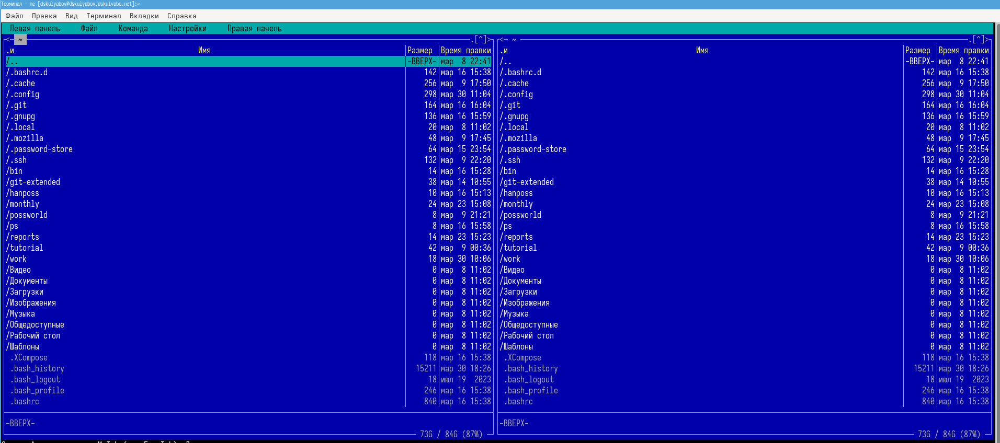
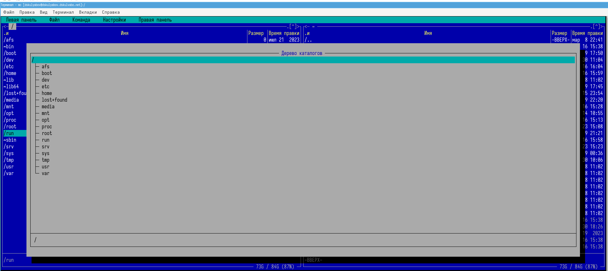
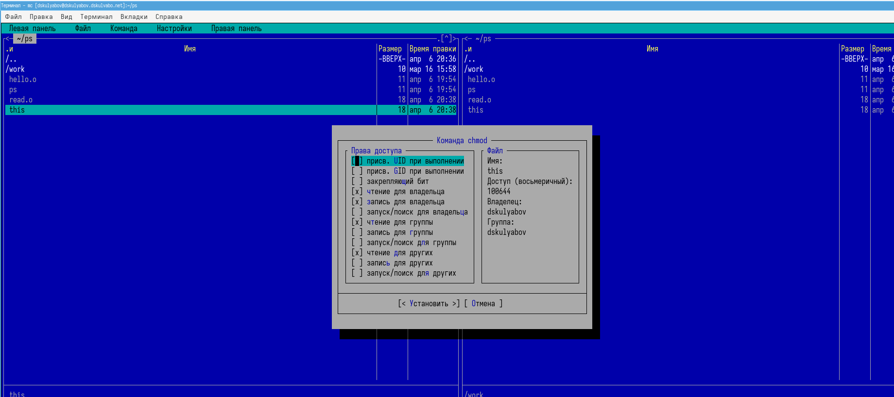

---
## Front matter
title: "Шаблон отчёта по лабораторной работе"
subtitle: "Простейший вариант"
author: "Хань Цзянтао"

## Generic otions
lang: ru-RU
toc-title: "Содержание"

## Bibliography
bibliography: bib/cite.bib
csl: pandoc/csl/gost-r-7-0-5-2008-numeric.csl

## Pdf output format
toc: true # Table of contents
toc-depth: 2
lof: true # List of figures
lot: true # List of tables
fontsize: 12pt
linestretch: 1.5
papersize: a4
documentclass: scrreprt
## I18n polyglossia
polyglossia-lang:
  name: russian
  options:
	- spelling=modern
	- babelshorthands=true
polyglossia-otherlangs:
  name: english
## I18n babel
babel-lang: russian
babel-otherlangs: english
## Fonts
mainfont: PT Serif
romanfont: PT Serif
sansfont: PT Sans
monofont: PT Mono
mainfontoptions: Ligatures=TeX
romanfontoptions: Ligatures=TeX
sansfontoptions: Ligatures=TeX,Scale=MatchLowercase
monofontoptions: Scale=MatchLowercase,Scale=0.9
## Biblatex
biblatex: true
biblio-style: "gost-numeric"
biblatexoptions:
  - parentracker=true
  - backend=biber
  - hyperref=auto
  - language=auto
  - autolang=other*
  - citestyle=gost-numeric
## Pandoc-crossref LaTeX customization
figureTitle: "Рис."
tableTitle: "Таблица"
listingTitle: "Листинг"
lofTitle: "Список иллюстраций"
lotTitle: "Список таблиц"
lolTitle: "Листинги"
## Misc options
indent: true
header-includes:
  - \usepackage{indentfirst}
  - \usepackage{float} # keep figures where there are in the text
  - \floatplacement{figure}{H} # keep figures where there are in the text
---

# Цель работы

Освоение основных возможностей командной оболочки Midnight Commander. Приоб-
ретение навыков практической работы по просмотру каталогов и файлов; манипуляций
с ними

# Задание

1. Выполнение лабораторной работы
2. Список литературы
# Теоретическое введение

# Выполнение лабораторной работы
### **4.1Общие сведения**
омандная оболочка — интерфейс взаимодействия пользователя с операционной систе-
мой и программным обеспечением посредством команд.
Midnight Commander (или mc) — псевдографическая командная оболочка для UNIX/Linux
систем. Для запуска mc необходимо в командной строке набрать mc и нажать Enter .
Рабочее пространство mc имеет две панели, отображающие по умолчанию списки
файлов двух каталогов (рис. 7.1).

{#fig:001 width=70%}

Рис. 7.1. Внешний вид экрана при работе с Midnight Commander
Над панелями располагается меню, доступ к которому осуществляется с помощью
клавиши F9 . Под панелями внизу расположены управляющие экранные кнопки, ассоци-
ированные с функциональными клавишами F1 – F10 (табл. 7.1). Над ними располагается
командная строка, предназначенная для ввода команд.

Функциональные клавиши mc
***
F1 Вызов контекстно-зависимой подсказки
F2 Вызов пользовательского меню с возможностью создания и/или допол-
нения дополнительных функций
F3 Просмотр содержимого файла, на который указывает подсветка в ак-
тивной панели (без возможности редактирования)
F4 Вызов встроенного в mc редактора для изменения содержания файла,
на который указывает подсветка в активной панели
F5 Копирование одного или нескольких файлов, отмеченных в первой
(активной) панели, в каталог, отображаемый на второй панели
F6 Перенос одного или нескольких файлов, отмеченных в первой (актив-
ной) панели, в каталог, отображаемый на второй панели
F7 Создание подкаталога в каталоге, отображаемом в активной панели
F8 Удаление одного или нескольких файлов (каталогов), отмеченных в пер-
вой (активной) панели файлов
F9 Вызов меню mc
F10 Выход из mc

### 4.2Режимы отображения панелей и управление ими

Панель в mc отображает список файлов текущего каталога. Абсолютный путь к этому
каталогу отображается в заголовке панели. У активной панели заголовок и одна из её
строк подсвечиваются. Управление панелями осуществляется с помощью определённых
комбинаций клавиш или пунктов меню mc.
Панели можно поменять местами. Для этого и используется комбинация клавиш Ctrl-u
или команда меню mc Переставить панели . Также можно временно убрать отображение
панелей (отключить их) с помощью комбинации клавиш Ctrl-o или команды меню mc
Отключить панели . Это может быть полезно, например, если необходимо увидеть вывод
какой-то информации на экран после выполнения какой-либо команды shell.
С помощью последовательного применения комбинации клавиш Ctrl-x d есть
возможность сравнения каталогов, отображённых на двух панелях. Панели могут допол-
нительно быть переведены в один из двух режимов: Информация или Дерево . В режиме
Информация (рис. 7.2) на панель выводятся сведения о файле и текущей файловой системе,
расположенных на активной панели. В режиме Дерево (рис. 7.3) на одной из панелей
выводится структура дерева каталогов.
Управлять режимами отображения панелей можно через пункты меню mc Правая панель
и Левая панель (рис. 7.4).

### 4.3Меню панелей

Перейти в строку меню панелей mc можно с помощью функциональной клавиши F9 .
В строке меню имеются пять меню: Левая панель , Файл , Команда , Настройки и Правая панель .

{#fig:001 width=70%}
Рис. 7.2. Режим Информация

{#fig:001 width=70%}
Рис. 7.3. Режим отображения дерева каталогов
Подпункт меню Быстрый просмотр позволяет выполнить быстрый просмотр содержимого
панели.

{#fig:001 width=70%}
Рис. 7.4. Меню Левая Панель

{#fig:001 width=70%}
Подпункт меню Информация позволяет посмотреть информацию о файле или каталоге
(рис. 7.5).

В меню каждой (левой или правой) панели можно выбрать Формат списка :
– стандартный — выводит список файлов и каталогов с указанием размера и времени
правки;
– ускоренный — позволяет задать число столбцов, на которые разбивается панель при
выводе списка имён файлов или каталогов без дополнительной информации;
– расширенный — помимо названия файла или каталога выводит сведения о правах
доступа, владельце, группе, размере, времени правки;
– определённый пользователем — позволяет вывести те сведения о файле или каталоге,
которые задаст сам пользователь.
Подпункт меню Порядок сортировки позволяет задать критерии сортировки при выводе
списка файлов и каталогов: без сортировки, по имени, расширенный, время правки,
время доступа, время изменения атрибута, размер, узел.
### 4.4Меню Файл

В меню Файл содержит перечень команд, которые могут быть применены к одному
или нескольким файлам или каталогам (рис. 7.6).

{#fig:001 width=70%}
Рис. 7.6. Меню Файл

Команды меню Файл :
– Просмотр ( F3 ) — позволяет посмотреть содержимое текущего (или выделенного)
файла без возможности редактирования.
– Просмотр вывода команды ( М + ! ) — функция запроса команды с параметрами
(аргумент к текущему выбранному файлу).
– Правка ( F4 ) — открывает текущий (или выделенный) файл для его редактирования.
– Копирование ( F5 ) — осуществляет копирование одного или нескольких файлов или
каталогов в указанное пользователем во всплывающем окне место.
– Права доступа ( Ctrl-x c ) — позволяет указать (изменить) права доступа к одному
или нескольким файлам или каталогам (рис. 7.7).
{#fig:001 width=70%}
Рис. 7.7. Права доступа на файлы и каталоги

– Жёсткая ссылка ( Ctrl-x l ) — позволяет создать жёсткую ссылку к текущему (или
выделенному) файлу1.
– Символическая ссылка ( Ctrl-x s ) — позволяет создать символическую ссылку к теку-
щему (или выделенному) файлу2.
– Владелец/группа ( Ctrl-x o ) — позволяет задать (изменить) владельца и имя группы
для одного или нескольких файлов или каталогов.
– Права (расширенные) — позволяет изменить права доступа и владения для одного
или нескольких файлов или каталогов.
– Переименование ( F6 ) — позволяет переименовать (или переместить) один или
несколько файлов или каталогов.
– Создание каталога ( F7 ) — позволяет создать каталог.
– Удалить ( F8 ) — позволяет удалить один или несколько файлов или каталогов.
– Выход ( F10 ) — завершает работу mc.
### 4.5Меню Команда
В меню Команда содержатся более общие команды для работы с mc (рис. 7.8).
Команды меню Команда :
– Дерево каталогов — отображает структуру каталогов системы.
– Поиск файла — выполняет поиск файлов по заданным параметрам.
{#fig:001 width=70%}
Рис. 7.8. Меню Команда

– Переставить панели — меняет местами левую и правую панели.
– Сравнить каталоги ( Ctrl-x d ) — сравнивает содержимое двух каталогов.
– Размеры каталогов — отображает размер и время изменения каталога (по умолчанию
в mc размер каталога корректно не отображается).
– История командной строки — выводит на экран список ранее выполненных в оболочке
команд.
– Каталоги быстрого доступа ( Ctrl-\ ) — пр вызове выполняется быстрая смена текущего
каталога на один из заданного списка.
– Восстановление файлов — позволяет восстановить файлы на файловых системах ext2
и ext3.
– Редактировать файл расширений — позволяет задать с помощью определённого син-
таксиса действия при запуске файлов с определённым расширением (например, какое
программного обеспечение запускать для открытия или редактирования файлов с рас-
ширением doc или docx).
– Редактировать файл меню — позволяет отредактировать контекстное меню пользова-
теля, вызываемое по клавише F2 .
– Редактировать файл расцветки имён — позволяет подобрать оптимальную для поль-
зователя расцветку имён файлов в зависимости от их типа.

### 4.6Меню Настройки
Меню Настройки содержит ряд дополнительных опций по внешнему виду и функцио-
нальности mc (рис. 7.9).
Меню Настройки содержит:
– Конфигурация — позволяет скорректировать настройки работы с панелями.

{#fig:001 width=70%}
Рис. 7.9. Меню Настройки
– Внешний вид и Настройки панелей — определяет элементы (строка меню, команд-
ная строка, подсказки и прочее), отображаемые при вызове mc, а также геометрию
расположения панелей и цветовыделение.
– Биты символов — задаёт формат обработки информации локальным терминалом.
– Подтверждение — позволяет установить или убрать вывод окна с запросом подтвер-
ждения действий при операциях удаления и перезаписи файлов, а также при выходе
из программы.
– Распознание клавиш — диалоговое окно используется для тестирования функцио-
нальных клавиш, клавиш управления курсором и прочее.
– Виртуальные ФС –– настройки виртуальной файловой системы: тайм-аут, пароль
и прочее.

### 4.7Редактор mc
Встроенный в mc редактор вызывается с помощью функциональной клавиши F4 . В нём
удобно использовать различные комбинации клавиш при редактировании содержимого
(как правило текстового) файла (табл. 7.2).
# Выводы

# Список литературы{.unnumbered}

::: {#refs}

1. GDB: The GNU Project Debugger. — URL: https://www.gnu.org/software/gdb/.

2. GNU Bash Manual. — 2016. — URL: https://www.gnu.org/software/bash/manual/.

3. Midnight Commander Development Center. — 2021. — URL: https://midnight

commander. org/.

4. NASM Assembly Language Tutorials. — 2021. — URL: https://asmtutor.com/.

5. Newham C. Learning the bash Shell: Unix Shell Programming. — O’Reilly

Media, 2005. — 354 с. — (In a Nutshell). — ISBN 0596009658. — URL:

http://www.amazon.com/Learningbash-Shell-Programming-Nutshell/dp/0596009658.

6. Robbins A. Bash Pocket Reference. — O’Reilly Media, 2016. — 156 с. — ISBN

978-1491941591.

7. The NASM documentation. — 2021. — URL: https://www.nasm.us/docs.php.

8. Zarrelli G. Mastering Bash. — Packt Publishing, 2017. — 502 с. — ISBN

9781784396879.

9. Колдаев В. Д., Лупин С. А. Архитектура ЭВМ. — М. : Форум, 2018.

10. Куляс О. Л., Никитин К. А. Курс программирования на ASSEMBLER. — М. :

Солон-Пресс, 2017.

11. Новожилов О. П. Архитектура ЭВМ и систем. — М. : Юрайт, 2016.

12. Расширенный ассемблер: NASM.— 2021.—URL: https://www.opennet.ru/docs/RUS/nasm/.

13. Робачевский А., Немнюгин С., Стесик О. Операционная система UNIX. — 2-е

изд. — БХВПетербург, 2010. — 656 с. — ISBN 978-5-94157-538-1.

14. Столяров А. Программирование на языке ассемблера NASM для ОС Unix.— 2-

е изд.—М. : МАКС Пресс, 2011.—URL: http://www.stolyarov.info/books/asm_unix.:::
