---
## Front matter
title: "Шаблон отчёта по лабораторной работе"
subtitle: "Простейший вариант"
author: "Хань Цзянтао"

## Generic otions
lang: ru-RU
toc-title: "Содержание"

## Bibliography
bibliography: bib/cite.bib
csl: pandoc/csl/gost-r-7-0-5-2008-numeric.csl

## Pdf output format
toc: true # Table of contents
toc-depth: 2
lof: true # List of figures
lot: true # List of tables
fontsize: 12pt
linestretch: 1.5
papersize: a4
documentclass: scrreprt
## I18n polyglossia
polyglossia-lang:
  name: russian
  options:
	- spelling=modern
	- babelshorthands=true
polyglossia-otherlangs:
  name: english
## I18n babel
babel-lang: russian
babel-otherlangs: english
## Fonts
mainfont: PT Serif
romanfont: PT Serif
sansfont: PT Sans
monofont: PT Mono
mainfontoptions: Ligatures=TeX
romanfontoptions: Ligatures=TeX
sansfontoptions: Ligatures=TeX,Scale=MatchLowercase
monofontoptions: Scale=MatchLowercase,Scale=0.9
## Biblatex
biblatex: true
biblio-style: "gost-numeric"
biblatexoptions:
  - parentracker=true
  - backend=biber
  - hyperref=auto
  - language=auto
  - autolang=other*
  - citestyle=gost-numeric
## Pandoc-crossref LaTeX customization
figureTitle: "Рис."
tableTitle: "Таблица"
listingTitle: "Листинг"
lofTitle: "Список иллюстраций"
lotTitle: "Список таблиц"
lolTitle: "Листинги"
## Misc options
indent: true
header-includes:
  - \usepackage{indentfirst}
  - \usepackage{float} # keep figures where there are in the text
  - \floatplacement{figure}{H} # keep figures where there are in the text
---

# Цель работы

Познакомиться с операционной системой Linux. Получить практические навыки рабо-
ты с редактором Emacs.
# Задание
1. Ознакомиться с теоретическим материалом.
2. знакомиться с редактором emacs.
3. Выполнить упражнения.
4. Ответить на контрольные вопросы.

# Теоретическое введение
Emacs представляет собой мощный экранный редактор текста, написанный на языке
высокого уровня Elisp.
## Основные термины Emacs
Определение 1. Буфер — объект, представляющий какой-либо текст.
Буфер может содержать что угодно, например, результаты компиляции программы
или встроенные подсказки. Практически всё взаимодействие с пользователем, в том
числе интерактивное, происходит посредством буферов.

Определение 2. Фрейм соответствует окну в обычном понимании этого слова. Каждый
фрейм содержит область вывода и одно или несколько окон Emacs.

Определение 3. Окно — прямоугольная область фрейма, отображающая один из буфе-
ров.

Каждое окно имеет свою строку состояния, в которой выводится следующая информа-
ция: название буфера, его основной режим, изменялся ли текст буфера и как далеко вниз
по буферу расположен курсор. Каждый буфер находится только в одном из возможных
основных режимов. Существующие основные режимы включают режим Fundamental
(наименее специализированный), режим Text, режим Lisp, режим С, режим Texinfo
и другие. Под второстепенными режимами понимается список режимов, которые вклю-
чены в данный момент в буфере выбранного окна.

пределение 4. Область вывода — одна или несколько строк внизу фрейма, в которой
Emacs выводит различные сообщения, а также запрашивает подтверждения и дополни-
тельную информацию от пользователя.

Определение 5. Минибуфер используется для ввода дополнительной информации и все-
гда отображается в области вывода.

Определение 6. Точка вставки — место вставки (удаления) данных в буфере.
## Основы работы в Emacs
Для запуска Emacs необходимо в командной строке набрать emacs (или emacs & для
работы в фоновом режиме относительно консоли).
Для работы с Emacs можно использовать как элементы меню, так и различные со-
четания клавиш. Например, для выхода из Emacs можно воспользоваться меню File
и выбрать пункт Quit , а можно нажать последовательно Ctrl-x Ctrl-c (в обозначениях
Emacs: C-x C-c).
Многие рутинные операции в Emacs удобнее производить с помощью клавиатуры, а не
графического меню. Наиболее часто в командах Emacs используются сочетания c клави-
шами Ctrl и Meta (в обозначениях Emacs: C- и M-; клавиша Shift в Emasc обозначается
как S-). Так как на клавиатуре для IBM PC совместимых ПК клавиши Meta нет, то вместо
неё можно использовать Alt или Esc . Для доступа к системе меню используйте клавишу
F10 .
Клавиши Ctrl , Meta и Shift принято называть префиксными. Например, запись M-x
означает, что надо удерживая клавишу Meta (или Alt ), нажать на клавишу x. Для открытия
файла следует использовать команду C-x C-f (надо, удерживая клавишу Ctrl , нажать на
клавишу x , затем отпустить обе клавиши и снова, удерживая клавишу Ctrl , нажать на
клавишу f ).
По назначению префиксные сочетания клавиш различаются следующим образом:
– C-x — префикс ввода основных команд редактора (например, открытия, закрытии,
сохранения файла и т.д.);
– C-c — префикс вызова функций, зависящих от используемого режима.
Определение 7. Режим — пакет расширений, изменяющий поведение буфера Emacs при
редактировании и просмотре текста (например, для редактирования исходного текста
программ на языках С или Perl).

## Выполнение лабораторной работы
### Основные команды emacs
1. Открыть emacs.
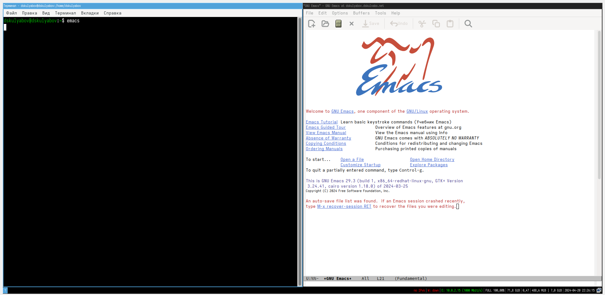
2. Создать файл lab07.sh с помощью комбинации Ctrl-x Ctrl-f (C-x C-f).
 
3. Наберите текст:
 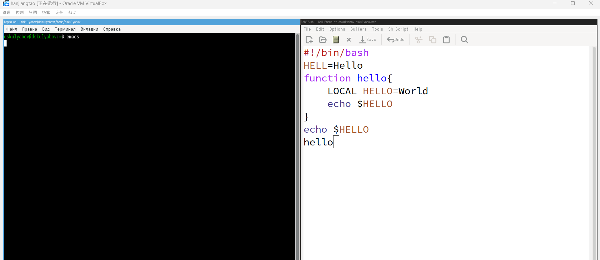
4. Сохранить файл с помощью комбинации Ctrl-x Ctrl-s (C-x C-s).
5. Проделать с текстом стандартные процедуры редактирования, каждое действие долж-
  но осуществляться комбинацией клавиш.
  1.  .Вырезать одной командой целую строку (С-k).

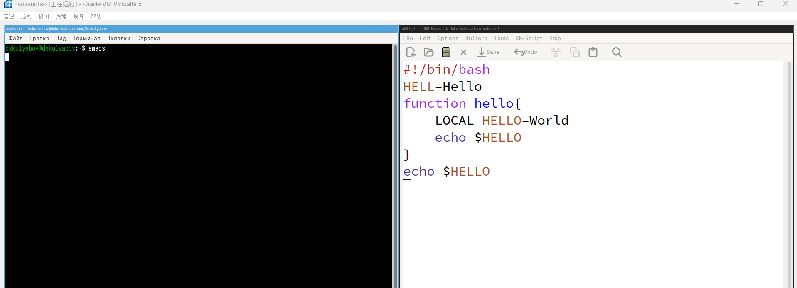
  2. Вставить эту строку в конец файла (C-y).
  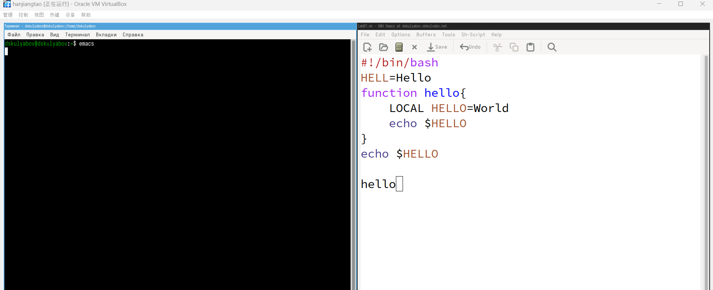
  3. Выделить область текста (C-space).
  
  4. Скопировать область в буфер обмена (M-w).
  
  5. Вставить область в конец файла.
  
  6. . Вновь выделить эту область и на этот раз вырезать её (C-w).
  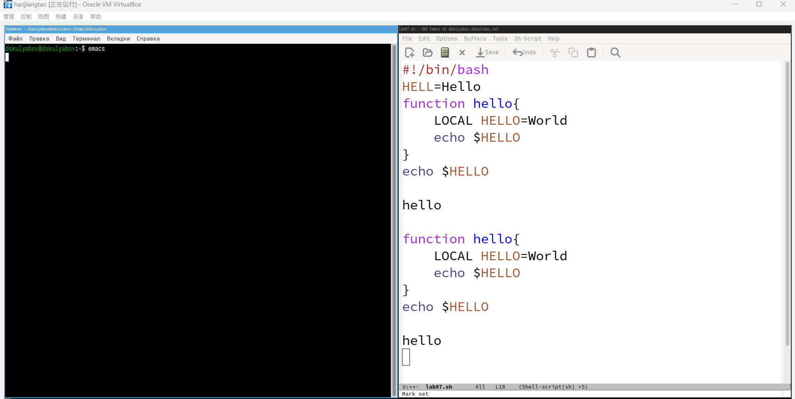

6. Научитесь использовать команды по перемещению курсора.
   1. Переместите курсор в начало строки (C-a).
  

   2. Переместите курсор в конец строки (C-e).
   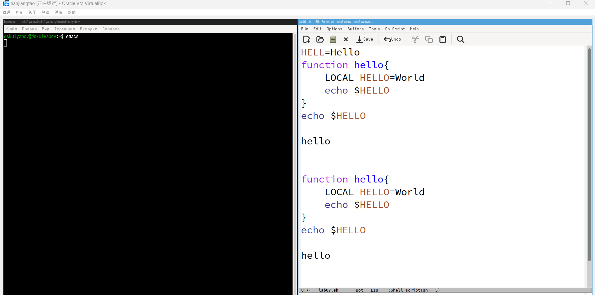
   3. Переместите курсор в начало буфера (M-<).
   
   4. Переместите курсор в конец буфера (M->).
   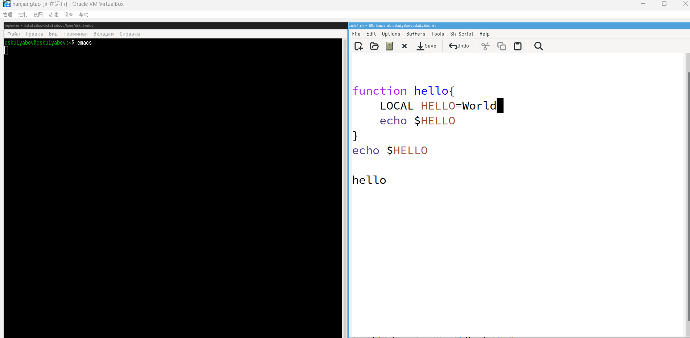
7. Управление буферами.
     1. Вывести список активных буферов на экран (C-x C-b).
     
     2. Переместитесь во вновь открытое окно (C-x) o со списком открытых буферов
        и переключитесь на другой буфер.
	 
     3. Закройте это окно (C-x 0).
      
     4. Теперь вновь переключайтесь между буферами, но уже без вывода их списка на
        экран (C-x b).
	 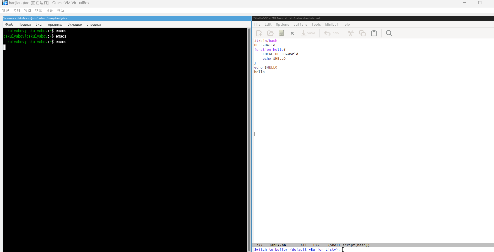
8. Управление окнами.
     1. Поделите фрейм на 4 части: разделите фрейм на два окна по вертикали (C-x 3),
     а затем каждое из этих окон на две части по горизонтали (C-x 2).
      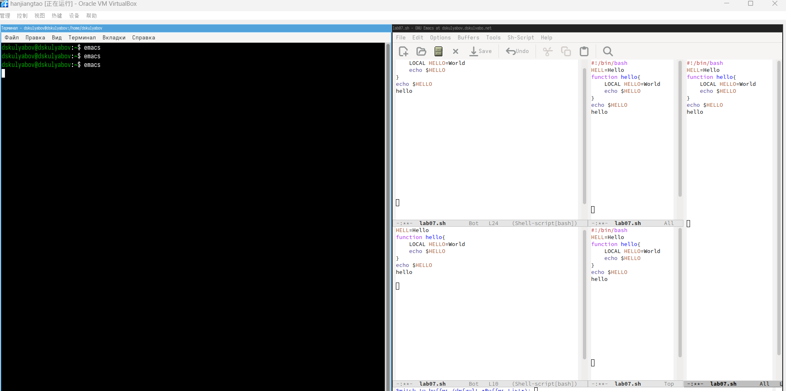
     2. В каждом из четырёх созданных окон откройте новый буфер (файл) и введите
     несколько строк текста.
      
9. Режим поиска
     1. Переключитесь в режим поиска (C-s) и найдите несколько слов, присутствующих
     в тексте.
      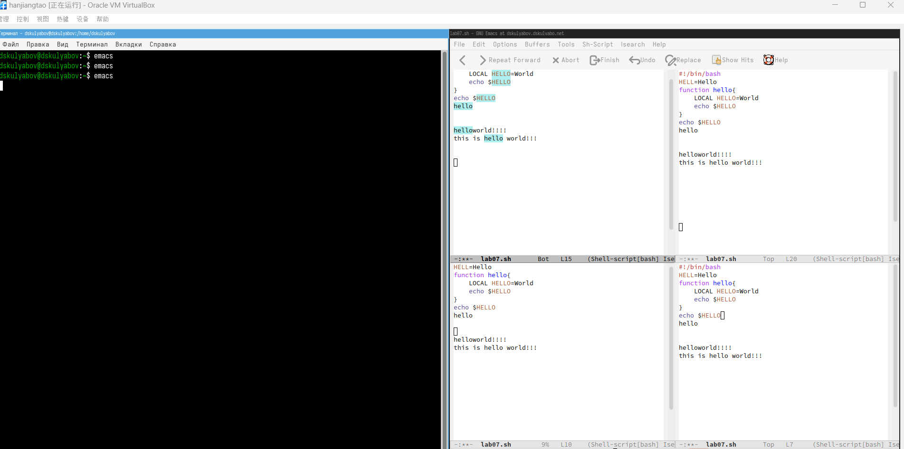
     2. Переключайтесь между результатами поиска, нажимая C-s.
      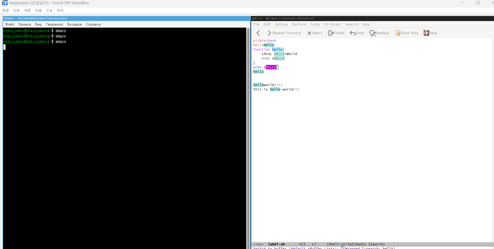
     3. Выйдите из режима поиска, нажав C-g.
      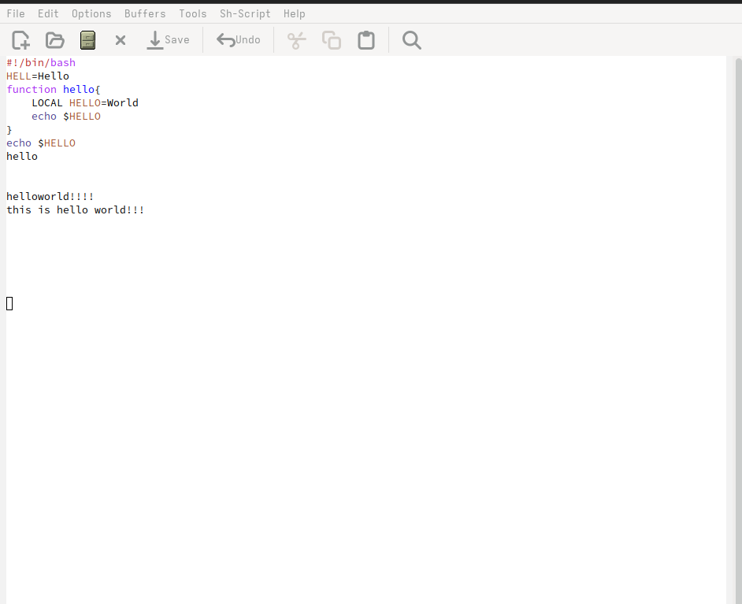
     4. Перейдите в режим поиска и замены (M-%), введите текст, который следует найти
     и заменить, нажмите Enter , затем введите текст для замены. После того как будут
     подсвечены результаты поиска, нажмите ! для подтверждения замены.
      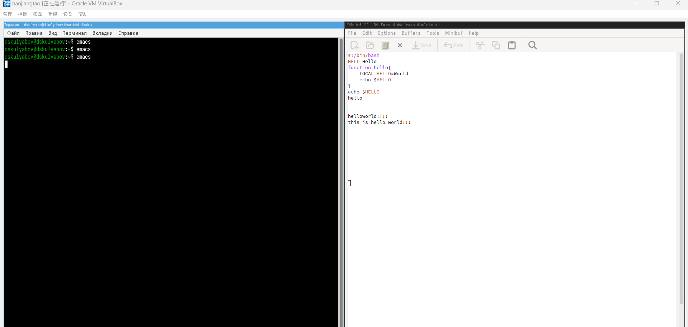
     5. Испробуйте другой режим поиска, нажав M-s o. Объясните, чем он отличается от
     обычного режима?
      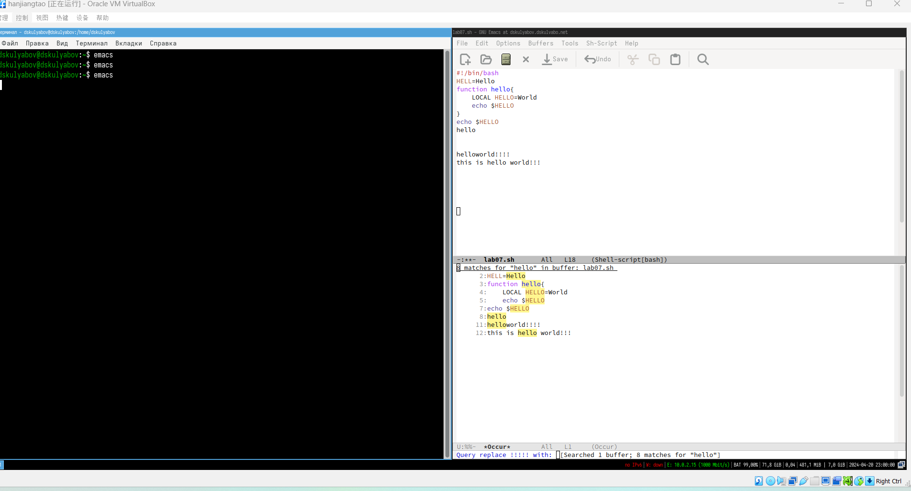

## Контрольные вопросы
1. Кратко охарактеризуйте редактор emacs.

   ​	Emacs - это мощный текстовый редактор с открытым исходным кодом, который предоставляет широкий спектр функций и возможностей для редактирования текста, управления файлами и интерпретации языков программирования.

   

2. Какие особенности данного редактора могут сделать его сложным для освоения но-
  вичком?

  Особенности Emacs, которые могут сделать его сложным для новичков, включают в себя обилие команд и сочетаний клавиш, необычную концепцию буферов и окон, а также необходимость настройки и установки пакетов для достижения определенного функционала.

3. Своими словами опишите, что такое буфер и окно в терминологии emacs’а.

   В терминологии Emacs буфер - это временное хранилище для текстовой информации, а окно - это область на экране, в которой отображается содержимое буфера. Один буфер может быть отображен в нескольких окнах, и одно окно может отображать разные буферы.

4. Можно ли открыть больше 10 буферов в одном окне?

   Да, в Emacs можно открыть больше 10 буферов в одном окне. Количество открытых буферов ограничено только ресурсами вашей системы.

5. Какие буферы создаются по умолчанию при запуске emacs?

   При запуске Emacs по умолчанию создаются несколько буферов, включая *scratch* (для временных заметок), *Messages* (для вывода сообщений), *GNU Emacs* (для приветствия) и другие, в зависимости от конфигурации.

6. Какие клавиши вы нажмёте, чтобы ввести следующую комбинацию C-c | и C-c C-|?

   Для ввода комбинаций `C-c |` и `C-c C-|` необходимо нажать и удерживать клавиши `Ctrl` и `c`, а затем нажать `|` или `C-|` соответственно.

7. Как поделить текущее окно на две части?

   Чтобы поделить текущее окно на две части, можно воспользоваться командой `C-x 3`. Это разделит текущее окно пополам по горизонтали.

8. В каком файле хранятся настройки редактора emacs?

   Настройки редактора Emacs обычно хранятся в файле `~/.emacs` или `~/.emacs.d/init.el`, но также могут быть разделены на несколько файлов и загружаться из различных источников.

9. Какую функцию выполняет клавиша и можно ли её переназначить?

   Клавиша `Alt` в Emacs выполняет ряд функций, включая создание мета-команд, перемещение по буферам и окнам, а также навигацию по меню. Её можно переназначить для выполнения других действий, но это может изменить стандартное поведение редактора.

10. Какой редактор вам показался удобнее в работе vi или emacs? Поясните почему.

    Предпочтение между Vi и Emacs может зависеть от индивидуальных предпочтений и потребностей. Некоторым пользователям нравится простота и эффективность Vi, а другим нравится гибкость и расширяемость Emacs. Важно выбрать тот редактор, который лучше всего соответствует вашему стилю работы и потребностям в редактировании текста.

# Выводы

# Список литературы{.unnumbered}

::: {#refs}

1. GDB: The GNU Project Debugger. — URL: https://www.gnu.org/software/gdb/.

2. GNU Bash Manual. — 2016. — URL: https://www.gnu.org/software/bash/manual/.

3. Midnight Commander Development Center. — 2021. — URL: https://midnight

commander. org/.

4. NASM Assembly Language Tutorials. — 2021. — URL: https://asmtutor.com/.

5. Newham C. Learning the bash Shell: Unix Shell Programming. — O’Reilly

Media, 2005. — 354 с. — (In a Nutshell). — ISBN 0596009658. — URL:

http://www.amazon.com/Learningbash-Shell-Programming-Nutshell/dp/0596009658.

6. Robbins A. Bash Pocket Reference. — O’Reilly Media, 2016. — 156 с. — ISBN

978-1491941591.

7. The NASM documentation. — 2021. — URL: https://www.nasm.us/docs.php.

8. Zarrelli G. Mastering Bash. — Packt Publishing, 2017. — 502 с. — ISBN

9781784396879.

9. Колдаев В. Д., Лупин С. А. Архитектура ЭВМ. — М. : Форум, 2018.

10. Куляс О. Л., Никитин К. А. Курс программирования на ASSEMBLER. — М. :

Солон-Пресс, 2017.

11. Новожилов О. П. Архитектура ЭВМ и систем. — М. : Юрайт, 2016.

12. Расширенный ассемблер: NASM.— 2021.—URL: https://www.opennet.ru/docs/RUS/nasm/.

13. Робачевский А., Немнюгин С., Стесик О. Операционная система UNIX. — 2-е

изд. — БХВПетербург, 2010. — 656 с. — ISBN 978-5-94157-538-1.

14. Столяров А. Программирование на языке ассемблера NASM для ОС Unix.— 2-

е изд.—М. : МАКС Пресс, 2011.—URL: http://www.stolyarov.info/books/asm_unix.:::
